# Jacob Williams 51 - Final Site - Ideation (Concept & Planning)

For my final website, I'm just gonna do something simple, a personal website talking about my experiences throughout this web-development class.  My Home page will just show the website title, the navigation bar, and some parallax images to help get the viewer interested.  As for my other pages; I am going to have an About page that obviously tells what the website is about (what I learned throughout the course mainly), a Contact page that'll show my contact information (email, phone #, etc.) and a Project Gallery page that will have images of my past homework projects that will also serve as links that take the viewer straight to them.  My navigation bar will feature links to; Home, About, Contact, and the Gallery section will have a dropdown menu that will have a few links to certain projects and the Project Gallery page in general.  I will have a little more information released when I have to turn in my wireframe sketches, but I think that my site map will also help explain my ideas.

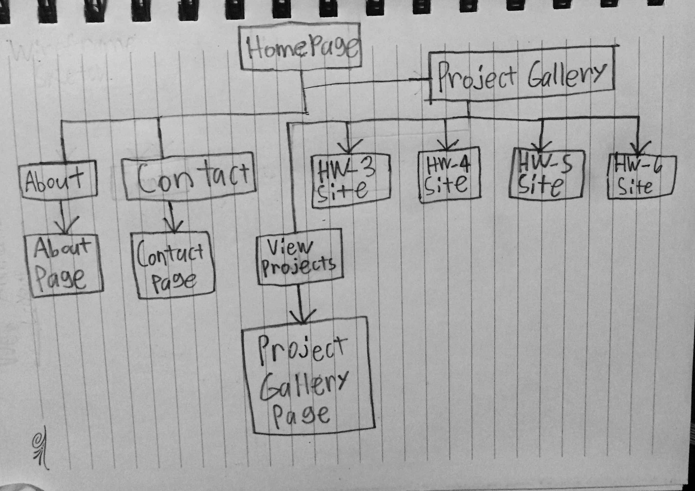

# Wireframe & Design

My final website is going well so far, I still have a few tweaks I gotta fix, but as soon as that gets done, I'll pretty much be finished with everything.  As for my further ideations;...

### Layout
My layout is structured similar to my Homework 9 Site I created weeks back (now that I mention it, my Homework 9 was kind of a head start of what I wanted my Final Site to look like).  Except this time, the title and navigation bar are merged together, to take the eye from left to right, then transition to the bottom as it gets to the page content.

### Color Scheme
My color scheme consists of colors from a fiery red palette I found on [this site](http://blog.visme.co/color-combinations/), with the addition of some tints and shades of orange, to create a bit of a warm tone and feeling to my site.  (Also because my account name is Jake The "Flare" and I usually like warmer color schemes.)

### Fonts
My font choice consists of two sans-serif-styled fonts named; <i>monofonto</i> and <i>young</i>.  I only wish for the text on my site to be simple and easy to read, but also interesting to view.  And I intend on doing that by adjusting the font sizes, headings, and colors.  

Like I said, I still have some tweaks to fix, and there might be a chance I'll have to change up my design a little bit, compared to my Wireframe sketches.  All in all, I'm looking forward to how it turns out.

## Wireframe Sketches
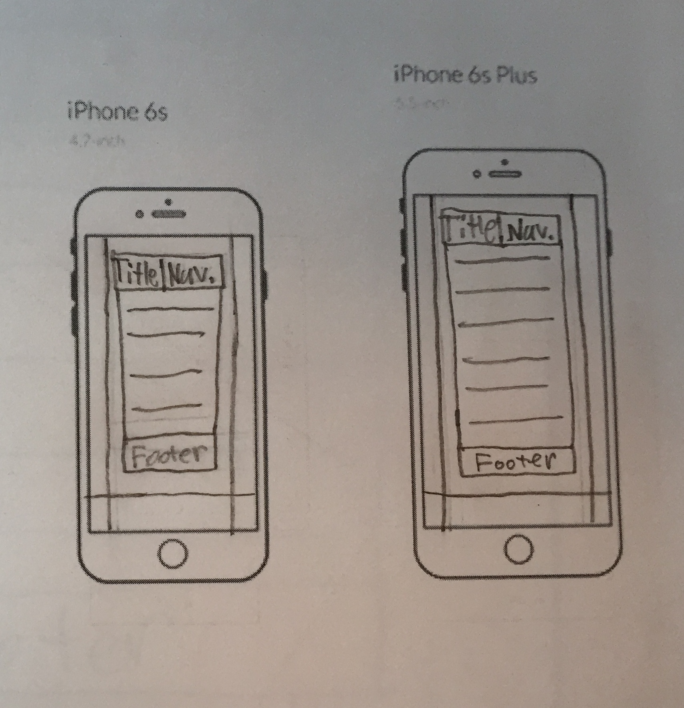
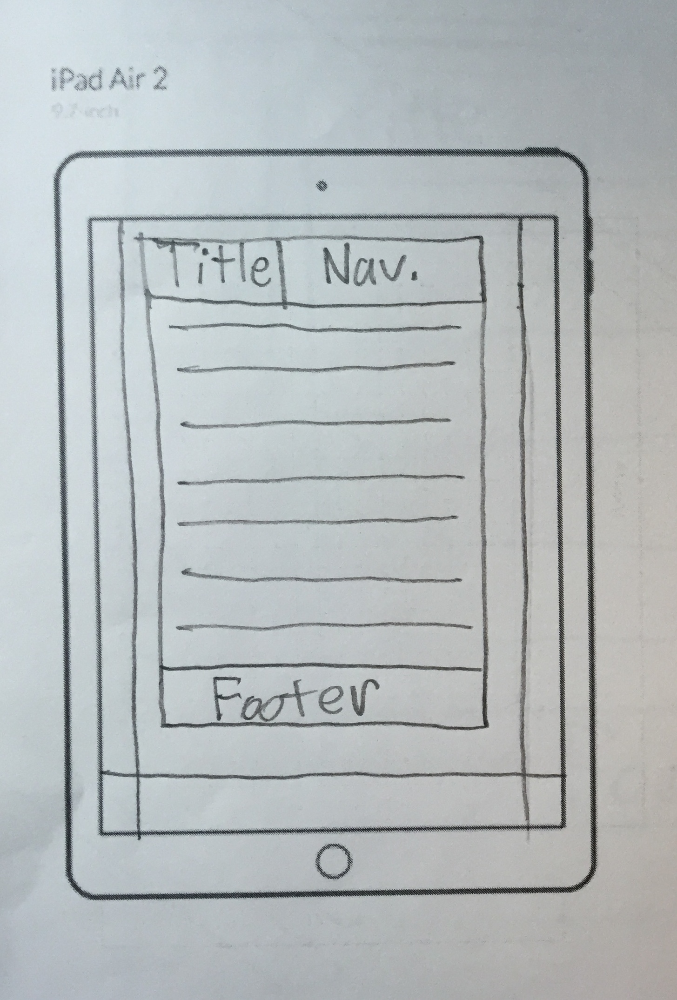
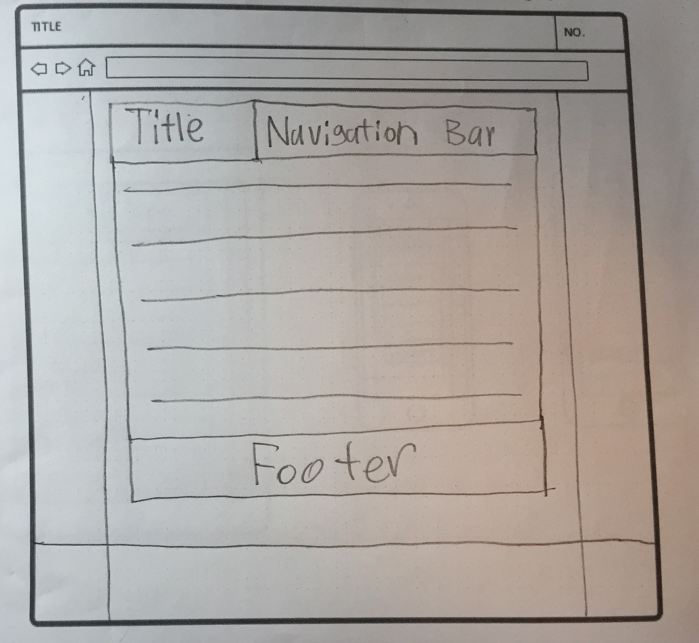

## Progress:
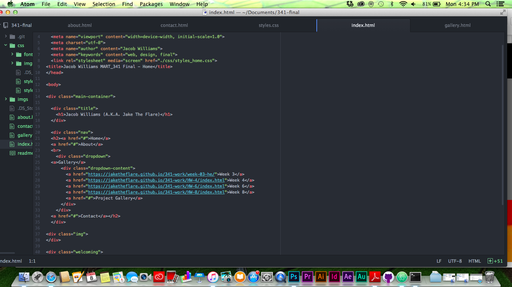
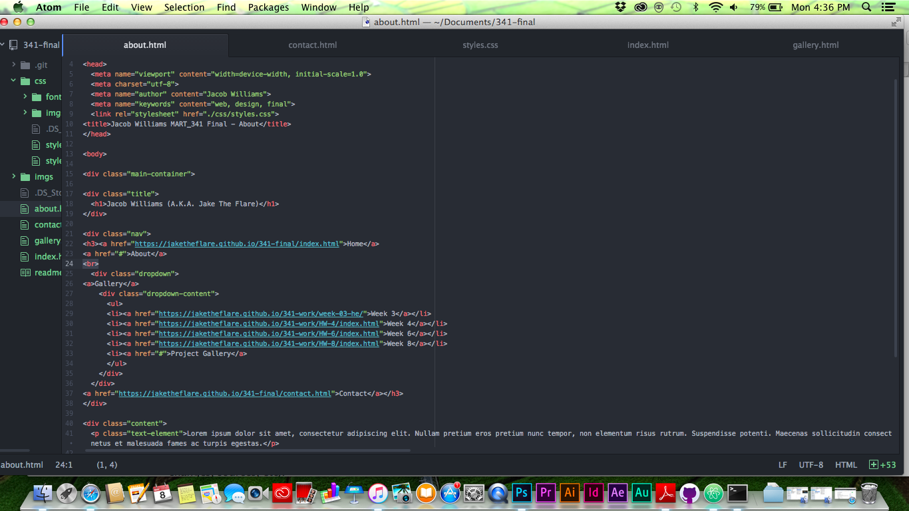
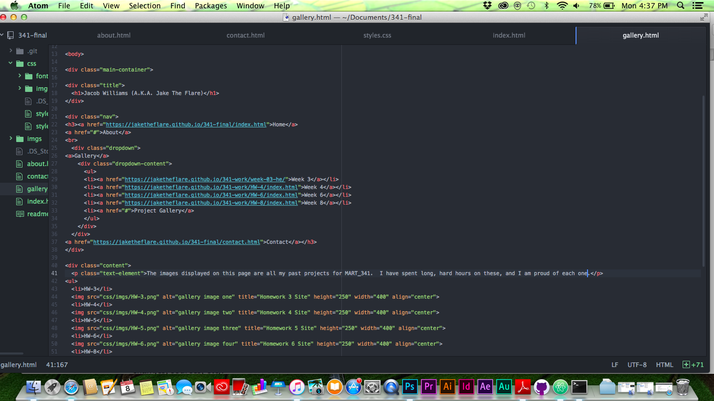
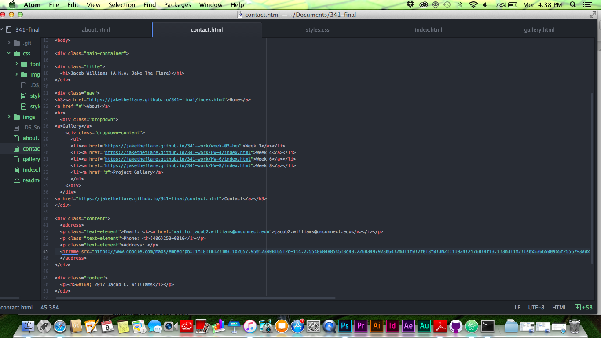

# Final Report
## Issues:
1. I have been having a hard time trying to connect the fonts I downloaded for my project to my css styles sheet.  I have been reviewing Week 08 to try to learn how to fix this issue.
2. The design idea I mentioned earlier about having the title and the navigation bar right next to each other was going alright at first.  But when I kept on doing RWD testing on my site, (i.e. viewing it on a mobile device) it just doesn’t work out and the content just keeps squishing together.  To be honest, I have no idea of what else to do to fix this issue, and I am getting tired of trying to do so.

## Changes:
The title and navigation bar are no longer going to be next to each other, my layout’s just going to have a standard top to bottom transition.  Although, I did add a logo next to my title.

## Feats:
1. Even though I did not create the exact website layout I wanted, the RWD testing has running a little more smoothly now.
2. After reviewing Chapter 8 a little bit, I have managed to figure out the font connection issue that I have been having, and my fonts are now showing on other devices.
3. I managed to push myself a little, by utilizing everything I learned throughout the semester.
4. I believe that I have created something to the required expectations of my instructor.

## Overall Summary:
Overall, I feel that taking this class has helped both refreshed, and sharpened my skills as a web designer.  Even though I will soon no longer be attending this class, I will continue to further utilize these skills and learn further more about these development techniques.

## Final Code Update:
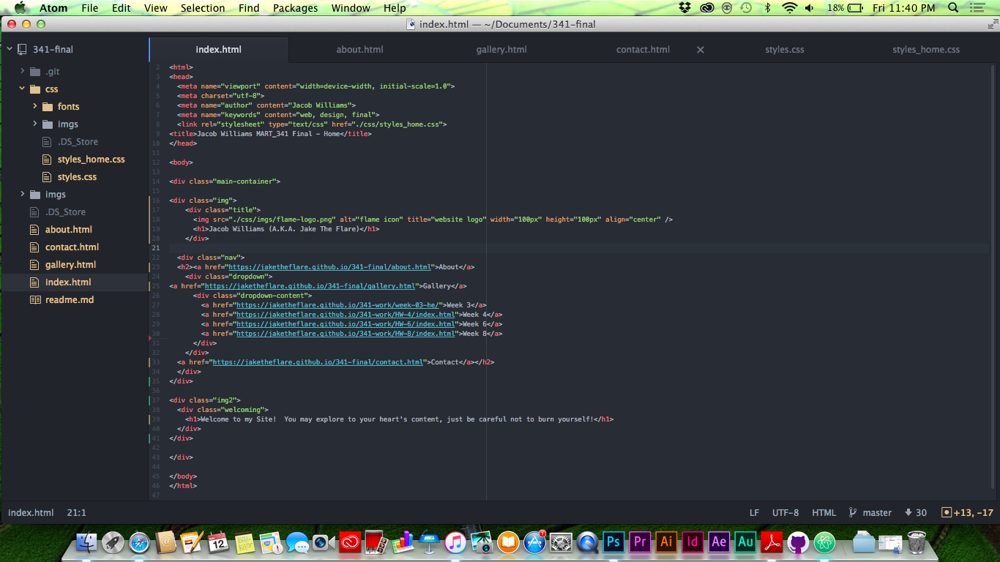
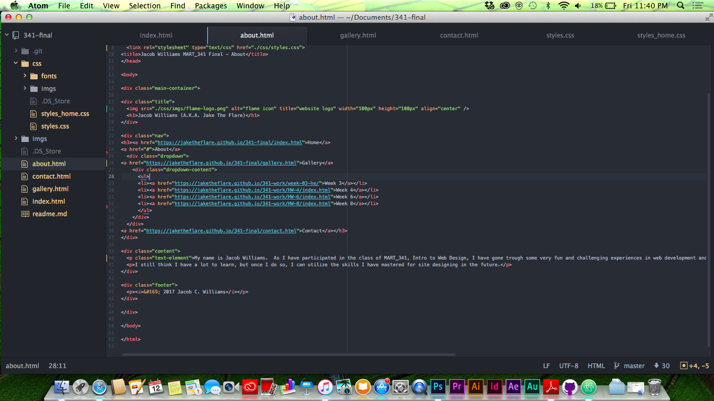
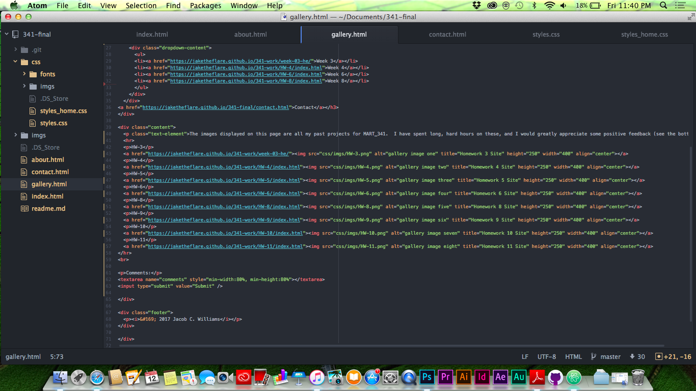
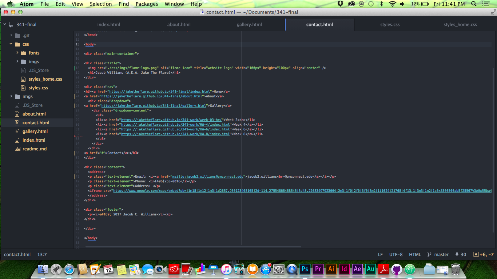
